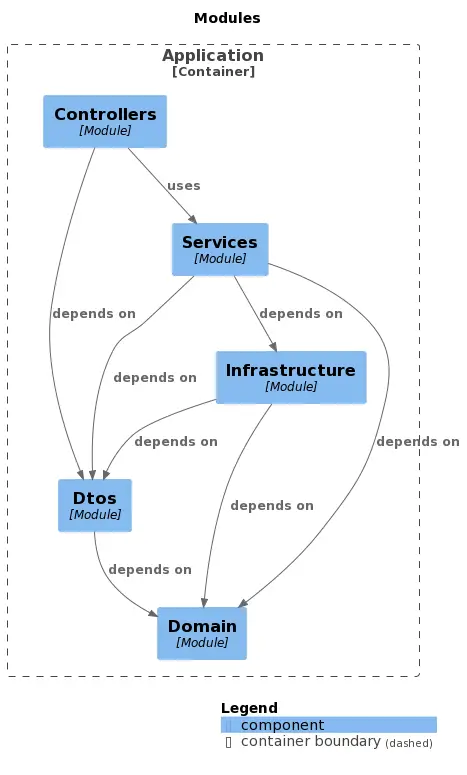

# Ecommerce API

This is a simple Ecommerce API that allows to manage products, categories and orders using hexagonal architecture.

## Tech stack

| **Technology** | **Description** |
|----------------|-----------------|
| Java | 18 |
| Spring Boot | 3.0.2 |
| H2 | 1.4.200 |
| Maven | 3.8.1 |

## Features

- Create, read, update and delete products
- Create, read, update and delete categories
- Create, read, update and delete orders
- Get all products
- Get all categories
- Get all orders
- Get product by id
- Get category by id
- Get order by id
- Get products by category
- Get orders by product

## Architecture



## Getting started

### Prerequisites

- Java 18
- Maven 3.8.1

1. Clone the repository

2. Navigate to the project directory

3. Build the project

    ```bash
    mvn clean install -DskipTests
    ```

4. Run the application

    ```bash
    mvn spring-boot:run
    ```

5. Access the application at `http://localhost:8080`

6. H2 local database is accesible at `http:\\localhost:8080\h2-console`  

7. Using the PostMan collection provided in the root of the project you can test the API.

## Change Log

| **Version** | **Description** |
|-------------|-----------------|
| 0.0.1       | Initial release |

## License

This project is licensed under the MIT License - see the [LICENSE](LICENSE) file for details.
